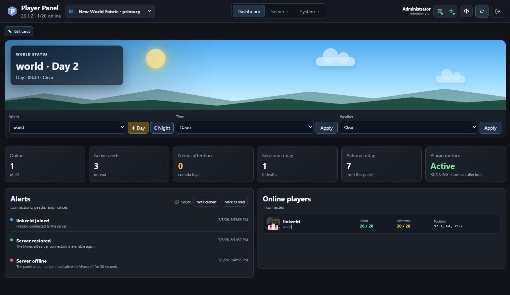
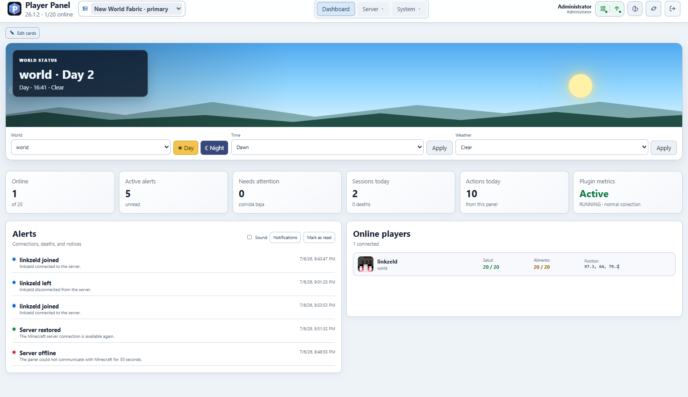
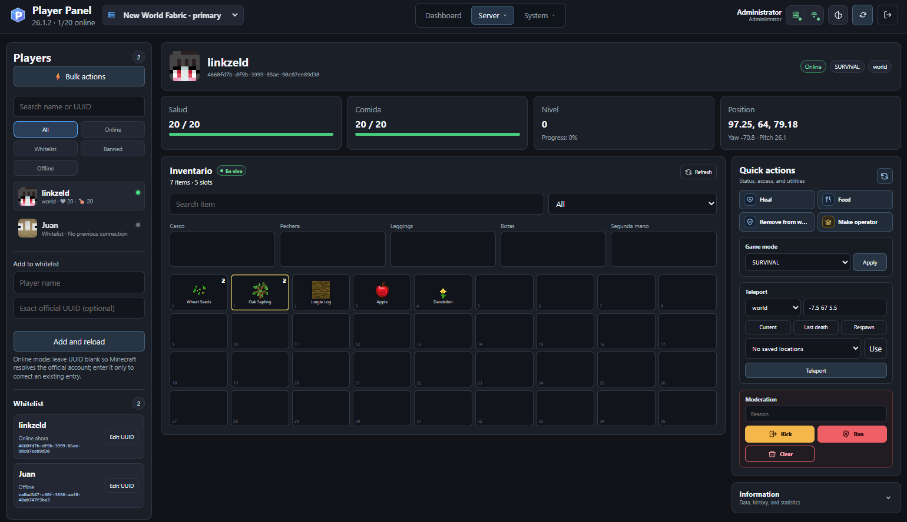
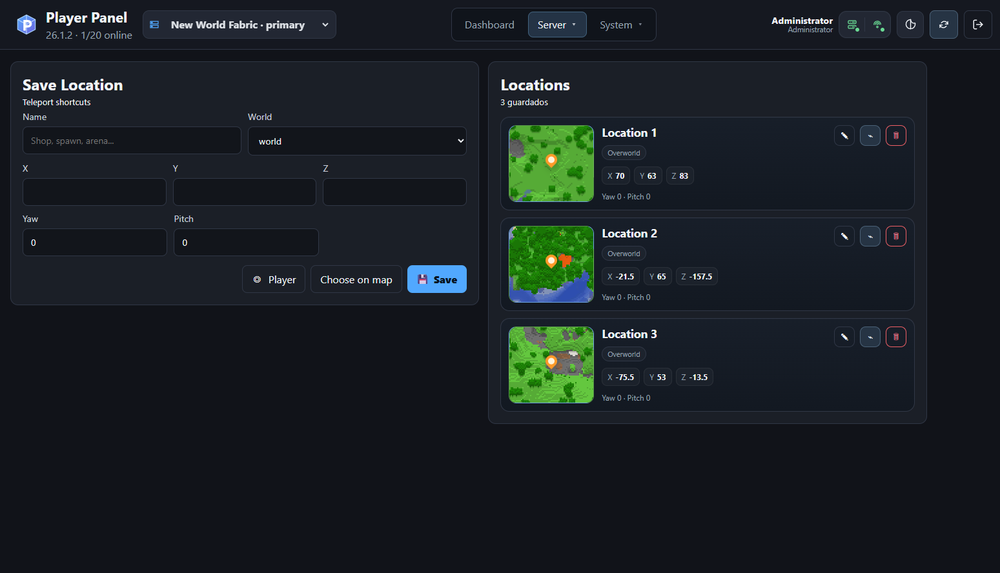
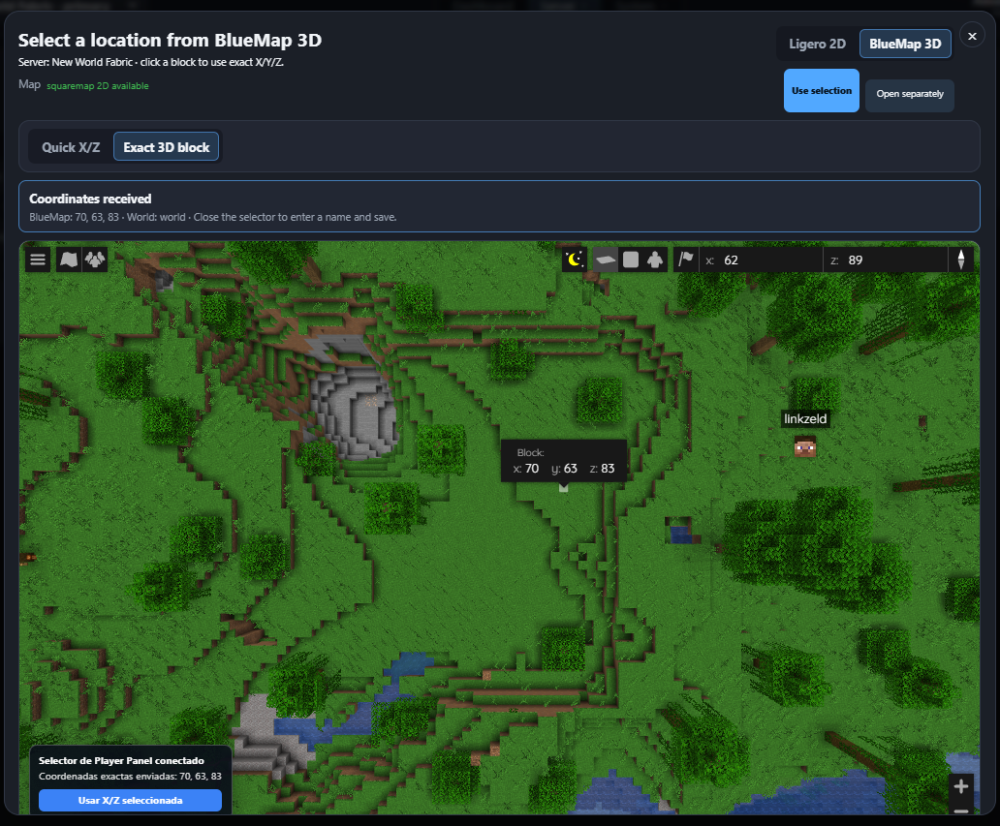
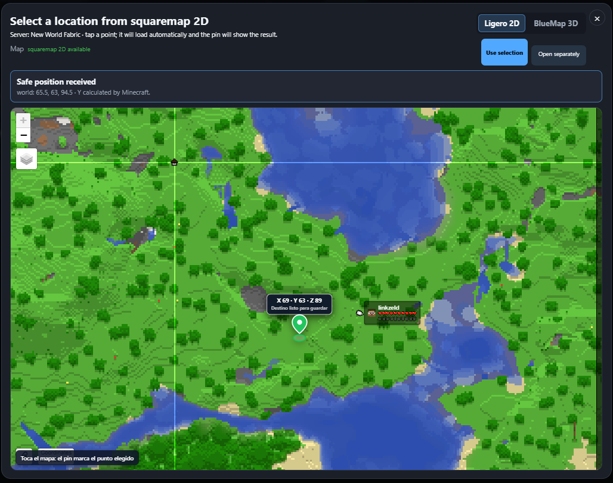
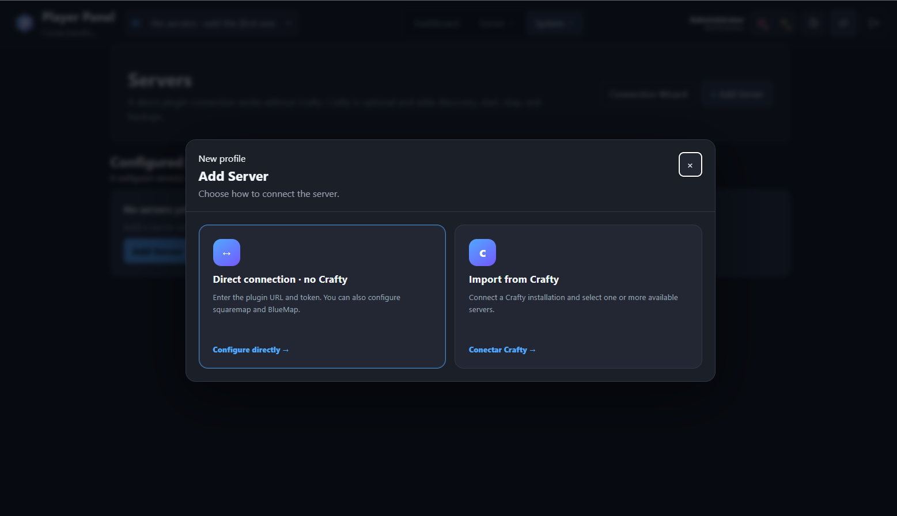
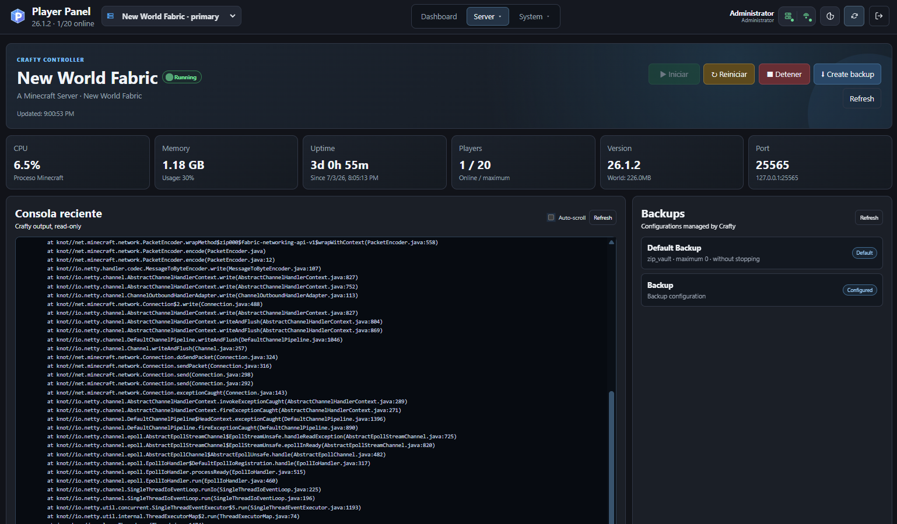
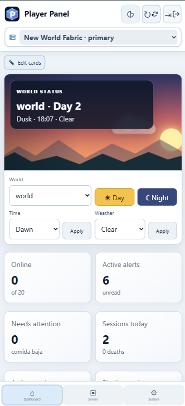

<p align="center">
  
</p>

<h1 align="center">Player Panel</h1>
<p align="center">
  
</p>
Player Panel is a self-hosted web control panel for Minecraft Java servers. It combines a responsive web application, a Fabric server mod, optional Crafty Controller integration, and optional BlueMap/squaremap map pickers.

> **Release status:** Beta. Back up your server and Player Panel data before upgrading.

## Project origin and public release policy

Player Panel is a **vibe-coding project** created through an iterative collaboration between the project owner and ChatGPT. The source code and documentation in this repository were written by ChatGPT from the owner's requirements, testing, feedback, and real deployment results.

`v1.0.0-beta.1` is intended to be the **only official public release from the original project**. No additional public releases, updates, maintenance, or support are promised by the original project.

The project is distributed under the MIT License. Anyone is free to use it, study it, modify it, redistribute it, and create a fork. Forks are explicitly encouraged for anyone who wants to fix issues, add features, support other Minecraft versions, or continue development independently. Please retain the required MIT license and copyright notice.

Because this is the only planned public release, pull requests and support requests may not be reviewed. For ongoing development, use your own fork.

## What it provides

- Player list, details, inventory, health, food, game mode, teleport, kick, ban, operator, and whitelist actions.
- Saved teleport locations with squaremap thumbnails and map-based coordinate selection.
- World time and weather controls.
- Alerts, action history, sessions, metrics, push notifications, roles, and multi-server profiles.
- Optional Crafty integration for discovery, start/stop/restart, logs, status, and backups.
- Optional BlueMap 3D and squaremap 2D integrations.
- PWA support for desktop, Android, iPhone, and iPad.
## Screenshots

### Dashboard

<p align="center">
  
</p>

The dashboard provides a real-time overview of the selected Minecraft server, including world status, time and weather controls, online players, active alerts, recent sessions, actions, and plugin metrics.

### Light and dark modes

<table>
  <tr>
    <td width="50%" align="center">
      
      <br>
      <strong>Dark mode</strong>
    </td>
    <td width="50%" align="center">
      
      <br>
      <strong>Light mode</strong>
    </td>
  </tr>
</table>

### Player management

<p align="center">
  
</p>

Player Panel provides player profiles, live inventory viewing, health and food information, game mode controls, teleportation, whitelist management, operator permissions, kicks, bans, and other moderation actions.

### Saved locations and teleportation

<p align="center">
  
</p>

Save reusable teleport destinations with world coordinates, orientation, map thumbnails, and direct access to BlueMap or squaremap coordinate selection.

### Map-based coordinate selection

<table>
  <tr>
    <td width="50%" align="center">
      
      <br>
      <strong>BlueMap 3D</strong>
      <br>
      Select an exact Minecraft block and send its X, Y and Z coordinates directly to Player Panel.
    </td>
    <td width="50%" align="center">
      
      <br>
      <strong>squaremap 2D</strong>
      <br>
      Choose a destination from a lightweight two-dimensional map with safe Y-coordinate calculation.
    </td>
  </tr>
</table>

### Server configuration

<p align="center">
  
</p>

Servers can be added through a direct connection to the Player Panel Fabric API or imported from an existing Crafty Controller installation.

### Crafty Controller integration

<p align="center">
  
</p>

The optional Crafty Controller integration provides server discovery, status and metrics, start, stop and restart actions, recent console output, and backup management.

### Responsive mobile interface

<table>
  <tr>
    <td width="68%" valign="middle">
      <strong>Desktop and mobile support</strong>
      <br><br>
      Player Panel includes a responsive interface designed for desktop computers, tablets, Android devices, iPhone and iPad.
      <br><br>
      The mobile layout provides:
      <br><br>
      • touch-friendly navigation;<br>
      • compact server selection;<br>
      • responsive dashboard cards;<br>
      • world time and weather controls;<br>
      • alerts and server status information;<br>
      • PWA installation support.
    </td>
    <td width="32%" align="center">
      
      <br>
      <strong>Mobile dashboard</strong>
    </td>
  </tr>
</table>

## Included versions

| Component | Version |
|---|---:|
| Full bundle | `1.0.0-beta.1` |
| Player Panel Web | `1.10.19` |
| Player Panel Fabric | `1.1.7` |
| Target Minecraft | `26.1.2` |
| BlueMap bridge | `v6` |
| squaremap bridge | `v7` |

The repository does **not** redistribute Minecraft, Crafty Controller, Fabric Loader, Fabric API, BlueMap, or squaremap. The guided installer can download compatible optional dependencies after explicit confirmation.

## Installation paths

Choose the path that matches your deployment:

### A. Full guided installation

Use this when Crafty and the Minecraft server are on the same machine, or when you want the installer to create a new Crafty deployment.

Download the official full installation package from the [v1.0.0-beta.1 release](https://github.com/linkzeld17/player-panel/releases/tag/v1.0.0-beta.1), extract it, and start the guided installer:

```bash
VERSION="1.0.0-beta.1"
PACKAGE="player-panel-${VERSION}.zip"
INSTALL_DIR="/tmp/player-panel-${VERSION}"

cd /tmp
rm -rf "${INSTALL_DIR}"
curl -fL \
  "https://github.com/linkzeld17/player-panel/releases/download/v${VERSION}/${PACKAGE}" \
  -o "${PACKAGE}"

mkdir -p "${INSTALL_DIR}"
unzip -q "${PACKAGE}" -d "${INSTALL_DIR}"
cd "$(dirname "$(find "${INSTALL_DIR}" -type f -name install.sh -print -quit)")"
chmod +x install.sh
./install.sh
```

The installer can:

1. install Docker Engine and Docker Compose v2 on Ubuntu/Debian;
2. reuse an existing Crafty container or install Crafty;
3. discover or select a Fabric 26.1.2 server;
4. configure online/offline authentication and whitelist enforcement;
5. verify or install Fabric API, squaremap, and BlueMap;
6. install the Player Panel Fabric mod and map bridges;
7. install Player Panel Web and display the detected access URLs.

See [Full installation](docs/INSTALL_FULL.md).

### B. Web panel only

Use this when Crafty/Minecraft run on another server, or when you want to connect everything manually from the web UI.

The full release bundle also includes the web-only installer. Download the official package from the [v1.0.0-beta.1 release](https://github.com/linkzeld17/player-panel/releases/tag/v1.0.0-beta.1), extract it, and run `install-panel-only.sh`:

```bash
VERSION="1.0.0-beta.1"
PACKAGE="player-panel-${VERSION}.zip"
INSTALL_DIR="/tmp/player-panel-${VERSION}"

cd /tmp
rm -rf "${INSTALL_DIR}"
curl -fL \
  "https://github.com/linkzeld17/player-panel/releases/download/v${VERSION}/${PACKAGE}" \
  -o "${PACKAGE}"

mkdir -p "${INSTALL_DIR}"
unzip -q "${PACKAGE}" -d "${INSTALL_DIR}"
cd "$(dirname "$(find "${INSTALL_DIR}" -type f -name install-panel-only.sh -print -quit)")"
chmod +x install-panel-only.sh
./install-panel-only.sh
```

The installer offers three clear starting modes:

1. **Direct plugin connection** — connect to the Fabric mod API without Crafty.
2. **Crafty-assisted setup** — register Crafty, discover servers, and optionally add management features.
3. **Configure later** — install an empty panel and open the Add Server wizard after login.

See [Web-only installation](docs/INSTALL_WEB_ONLY.md) and [Remote connections](docs/REMOTE_CONNECTIONS.md).

## Quick start

### Requirements

- Linux server; Ubuntu 22.04/24.04 or Debian 12 recommended.
- `root` access or a user with `sudo`.
- `curl` and `unzip` to download and extract the release package.
- Docker Engine and Docker Compose v2, or permission for the installer to install them.
- For the full path: Crafty Controller and a Minecraft Java Fabric 26.1.2 server.
- At least 10 characters for the initial Player Panel administrator password.

### Install the web panel only without preconfiguring servers

```bash
PLAYER_PANEL_ADMIN_PASSWORD='replace-with-a-strong-password' \
./install-panel-only.sh \
  --setup-mode later \
  --non-interactive \
  --yes
```

Default access:

```text
http://SERVER_IP:8766
```

For permanent Internet exposure, place Player Panel behind an HTTPS reverse proxy.

## Updating

Update only the web application without changing Minecraft, Crafty, mods, whitelist, or map configuration:

```bash
./update-web.sh --install-root /opt/player-panel --yes
```

Repair a complete local installation while preserving web data and secrets:

```bash
./repair-server.sh \
  --install-root /opt/player-panel \
  --container crafty-controller \
  --server-id YOUR_SERVER_UUID \
  --auth-mode keep \
  --yes
```

See [Updating](docs/UPDATING.md).

## Validation

```bash
chmod +x tests/*.sh tests/mock-docker
./tests/test-package.sh
```

For an installed system:

```bash
./validate.sh \
  --install-root /opt/player-panel \
  --container crafty-controller \
  --server-id YOUR_SERVER_UUID
```

## Network ports

Default ports used by the full installer:

| Service | Port | Protocol |
|---|---:|---|
| Player Panel Web | 8766 | TCP/HTTP |
| Player Panel Fabric API | 8765 | TCP/HTTP or proxied HTTPS |
| Crafty Web | 8443 | TCP/HTTPS |
| Minecraft Java | 25565 | TCP |
| Minecraft Bedrock (optional) | 19132 | UDP |
| BlueMap (optional) | 8100 | TCP/HTTP |
| squaremap (optional) | 8110 | TCP/HTTP |

Only expose the ports your architecture requires. Prefer HTTPS reverse proxies for public access.

## Repository layout

```text
components/fabric/          Fabric mod release JAR
components/web/             Web application and Docker files
integrations/bluemap/       BlueMap browser bridge
integrations/squaremap/     squaremap browser bridge
scripts/lib/                Shared installer helpers
scripts/maps/               Optional map setup scripts
tests/                      Installer and package regression tests
docs/                       Installation and operations documentation
.github/                    GitHub templates and CI workflow
```

## Security

- Never commit `.env`, SQLite databases, tokens, passwords, VAPID keys, backups, or real installation reports.
- Keep the Fabric API token private.
- Use a dedicated Crafty API token with the minimum required permissions.
- Prefer HTTPS for Player Panel, Crafty, plugin APIs, BlueMap, and squaremap when traffic crosses untrusted networks.
- Review [SECURITY.md](SECURITY.md) before publishing an instance.

## Documentation

- [Full installation](docs/INSTALL_FULL.md)
- [Web-only installation](docs/INSTALL_WEB_ONLY.md)
- [Remote connections](docs/REMOTE_CONNECTIONS.md)
- [Updating](docs/UPDATING.md)
- [Troubleshooting](docs/TROUBLESHOOTING.md)
- [Architecture](docs/ARCHITECTURE.md)
- [Testing](docs/TESTING.md)
- [Release checklist](docs/RELEASE_CHECKLIST.md)
- [Publishing to GitHub](docs/PUBLISHING_TO_GITHUB.md)

## License

Player Panel is released under the [MIT License](LICENSE). Third-party projects retain their own licenses; see [THIRD_PARTY_NOTICES.md](THIRD_PARTY_NOTICES.md).
